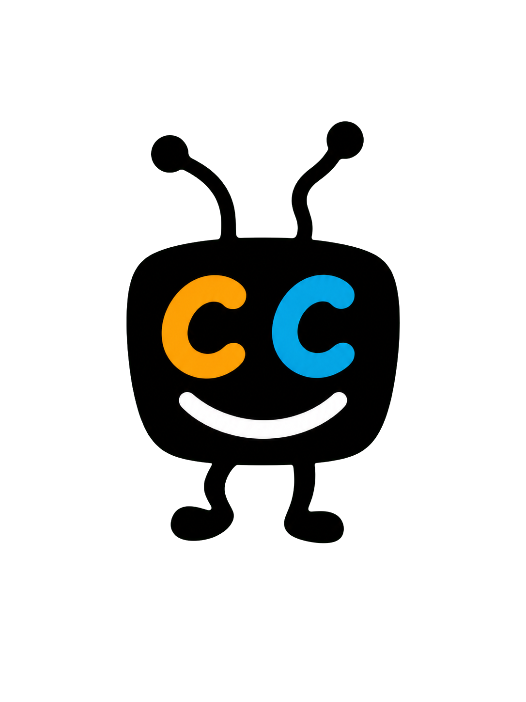
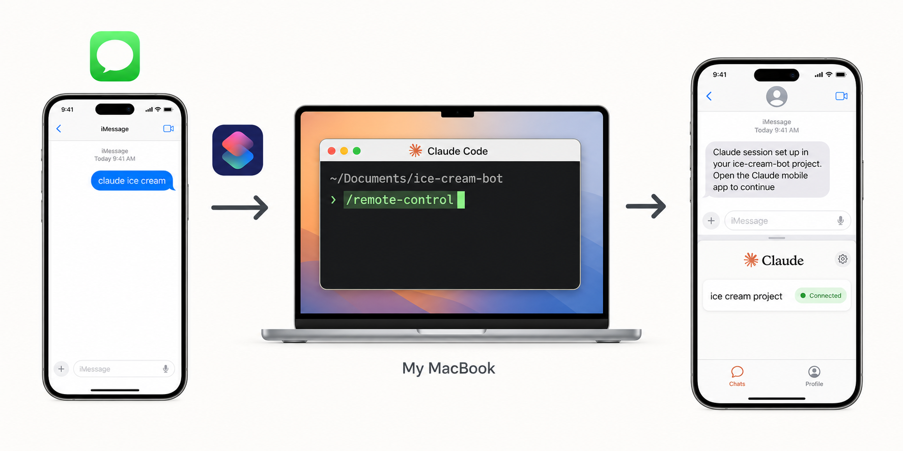

<p align="center">
  
</p>

<h1 align="center">cc-remote-control</h1>

<p align="center"><strong>Start Claude on your Mac or Linux box from a text.</strong></p>

<p align="center">
  
</p>

---

Claude Code only starts at the keyboard. This plugin lets you text
**"Claude &lt;project&gt;"** to yourself and have your Mac (iMessage)
or Linux box (HTTP over Tailscale) spin up a `/remote-control` session
in that folder — couch, airport, trail, anywhere.

No `chat.db` reading. No third-party messaging service. Sender filter
(macOS) or bearer-token auth (Linux). The router never sees a message
you didn't text yourself.

## Install

```bash
claude plugin marketplace add nathan-hekman/cc-remote-control
claude plugin install cc-remote-control@cc-remote-control
```

Restart Claude Code, then:

```
/cc-remote-control setup
```

5-minute wizard. Detects whether you're on macOS or Linux and walks
the right path.

## Two trigger paths

**macOS — native Shortcuts.** Shortcuts.app watches your own iMessage
thread for the keyword and runs the router directly. No listener, no
secret, no network exposure. ~5 min to set up.

**Linux — HTTP over Tailscale.** A tiny Python HTTP listener accepts
`POST /trigger` with a bearer-token header. iPhone Personal
Automation does the same Message → URL-POST flow, hitting the
listener over your tailnet. Same UX, different transport. ~10 min to
set up.

## Day-to-day

| You text          | Machine opens                      |
|-------------------|------------------------------------|
| `Claude eBay`     | `~/Documents/ebay-scrape-new`      |
| `Claude scraper`  | `~/Documents/cy-scraper-new`       |
| `Claude` (alone)  | macOS texts a project menu; Linux logs a menu |

New project? Just `mkdir` it under your projects root. No config change.

## Slash commands

| Command                       | What                                     |
|-------------------------------|------------------------------------------|
| `/cc-remote-control setup`    | Interactive setup wizard                 |
| `/cc-remote-control status`   | Config + project list + recent logs      |
| `/cc-remote-control test`     | Run the router locally, no network       |
| `/cc-remote-control tail`     | Last 20 log lines                        |
| `/cc-remote-control help`     | Reference card                           |

## More

- [INSTALL.md](INSTALL.md) — install reference, per-platform notes,
  dry-run, uninstall
- [SECURITY.md](SECURITY.md) — threat model, what's not protected
- [`.env.example`](.env.example) — config template

## License

[MIT](LICENSE)
